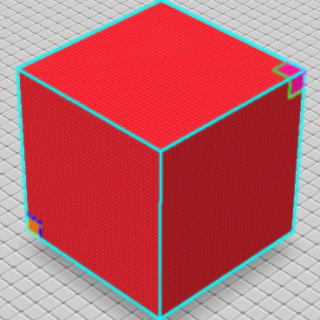

# /Cuboid

Creates a cuboid from two points.

When invoked, the command will ask the user for two block positions. Block positions are defined by breaking blocks, placing blocks or by using the `/mark` command. On the last point, the block being held will be used for filling the area.

- `/cuboid`

## Modes

Modes are defined in the first argument of the command. If the first argument is not a mode name, the argument will instead be used for finding a block. If a block cannot be resolved from a name or ID, the command will be canceled.

### `/Cuboid solid`

This mode is used by default if no modes are specified.

### `/Cuboid hollow`

### `/Cuboid walls`

### `/Cuboid holes`

### `/Cuboid wire`

### `/Cuboid random`
